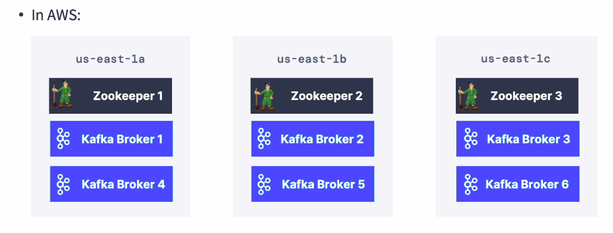
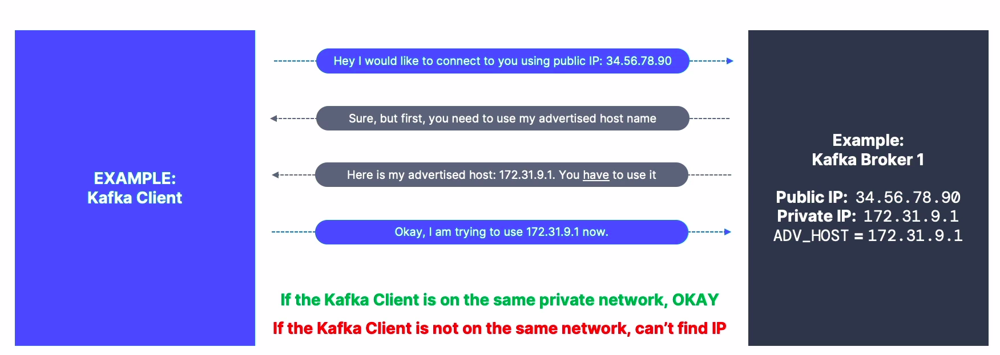
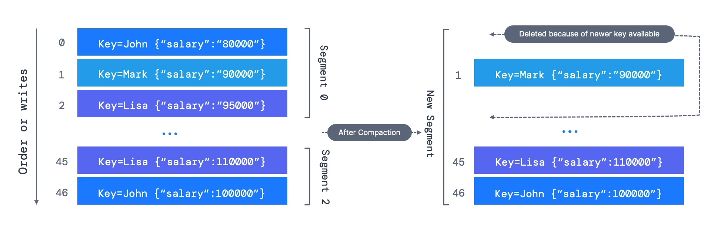
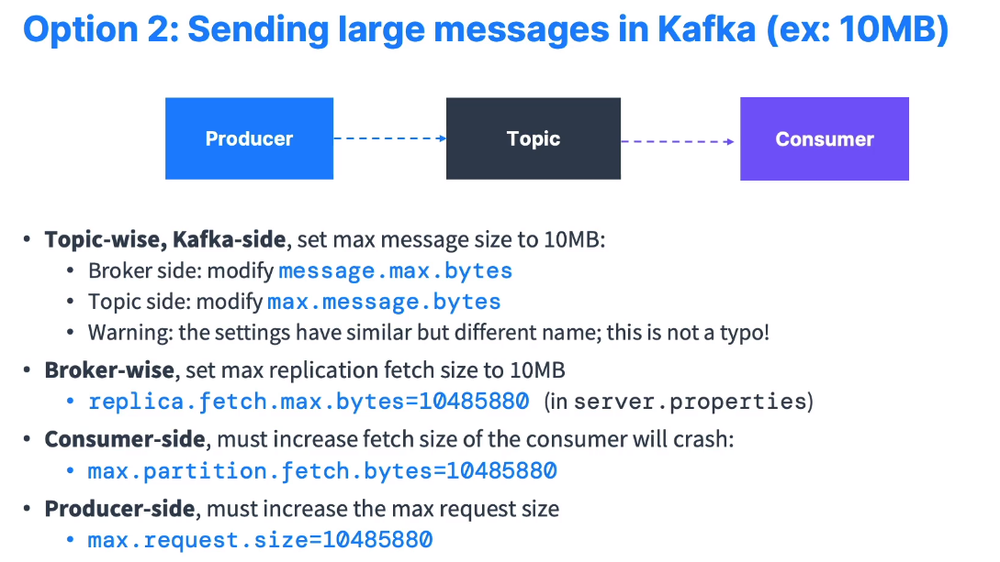

# kafka-notes

[Theory- hand written notes](./Resources/kafkaNotes.pdf)

## Producer

- ```producer.send(producerRecord);``` Here the send data is an async activity so we have to flush it before we close. ```producer.flush(); producer.close();```
- **Producer Acknowledgements**: Producer can choose to receive acknowledgement of data writes
  - **acks=0** -> Producer wont wait for acknowledgements thus possible data loss
  - **acks=1** -> Producer will wait for leader acknowledgement thus limited data loss. Also this is the default setting for v1-v2.8
  - **acks=all(or)-1** -> Producer will wait for leader and all in-sync replicas acknowledgement thus no data loss. "min.insync.replicas" This is used to specify atleast how many replicas should acknowledge. When min.insync.replicas = 2, it means that the leader along with one broker should acknowledge. Thus if "acks = all", "replication.factor = N", "min.insync.replicas=M" then we can tolerate N - M brokers going down for topic availability purpose. Eg "acks = all", "replication.factor = 3", "min.insync.replicas=2" then we can tolerate 1 broker going down.
- In case of failures like transient failures( Eg : NOT_ENOUGH_REPLICAS - this is caused due to min.insync.replicas setting) developers should handle it. Some of the properties are
  - **retries** => default is 0 for kafka < v2.0 and 2147483647 for kafka >= 2.1
  - **retry.backoff.ms** => This indicates how much time kafka should wait before the next retry. Defaults to 100ms.
- If retries>0 eg: retries=2147483647 then the retries are bounded by a timeout "delivery.timeout.ms". default is 2 mins. Within this delivery time we dont recieve any acknowledgement then the record will be considered as a failed message.
- Problem 1 : Thus if retries are enabled then there is a chance that the messages might lose its order.
- Problem 2 : The producers can introduce duplicate messages in kafka due to network errors. Eg: The producer produces message to kafka. Kafka commits the message and sends an acknowledgement but kafka's acknowledgement doesn't reach the producer due to producer's network error. Since retries are enabled the producer will send the message to kafka again. This results in duplicate messages.
- The above two issues are resolved by Idempotent Producers. Idempotent delivery ensures that messages are delivered exactly once to a particular topic partition during the lifetime of a single producer.These are the default producers since kafka > v3.0
- max.in.flight.requests.per.connection => This setting basically controls how many requests can be made in parallel to any partition, and so, by default that setting is 5, which explains why you can have some reordering, but you have to set it to 1 if you want to strictly ensure ordering. Obviously, by setting it to 1, you may get an impact on the throughput. If you set retries to a high number and you want to keep ordering, then you absolutely need to set max.inflight.requests.per.connection=1. If you need strict message ordering, set it to 1, but be prepared for potential throughput trade-offs.
- Idempotent producers default configs:
    - retries=2147483647
    - max.in.flight.requests.per.connection = 5(Kafka>=v1. This ensures higher performance and ordering KAFKA 5494)
    - acks = all
- Using Idempotent producers with max.in.flight.requests.per.connection set to 5 does not guarantee strict message ordering in Kafka. While the combination of these two features can reduce the likelihood of duplicate messages in the Kafka topic, it does not provide a guarantee of preserving the order of messages.
- Recommended producer Properties(The below properties are default in kafka > v3)
  ```
    acks=all
    replication factor = 3
    min.insync.replicas = 2
    enable.idempotence=true
    retries=MAX_INT (2147483647)
    delivery.timeout.ms=120000 (2 mins)
    max.in.flight.requests.per.connection=5
  ```
- Compression ratios upto 4 times can be achieved. Compression is more efficient when the batch of messages sent to kafka is of a bigger size. Compression is not applied to each message instead to the batch of messages.
- Enable compression in production(Producer level). Compression can happen in the producer level(all topics) or in the broker level.
- Compression types for the producer level : none(default), gzip, lz4(recommended), snappy(recommended), zstd. Comparion between different compression technologies=> https://blog.cloudflare.com/squeezing-the-firehose/
- (Broker)Compression can happen in the broker level(applied to all topics) and also to a particular topic.
- **Types of Brokers compression**
  - compresion.type=producer(default) => Here the broker takes the compressed batch from the producer and writes it to the topic.
  - compression.type=none => Here the broker takes the compressed batch from the producer, decompresses the data and writes it to the topic.(Not recommended)
  - compression.type=lz4(for eg.) => Here the broker takes the compressed batch from the producer
    -  If the producer's compression type and the broker's compression type are same then the data is stored as it is
    -  Else if the producer's and the broker's compression type are different then the batches are decompressed by the broker and compressed again.
 - It is advisable not to use broker side compression as it will use more CPU cycles.
 - By default kafka will send the data it receives asap. There are two factors that affects batching in kafka
   - **linger.ms** => How long to wait until we send a batch
   - **batch.size** => Used to increase the batch size. Default is 16kb. Any message that is bigger than the batch will not be batched and will be sent right away by the producer.
 - Key hashing is the process of determining the mapping of a key to a partition.
 - The keys are mapped to the partition using the Murmur2 Algorithm. Messages with the same key will end up in the same partition. But if a partiion is added or removed then the messages will end up in a different partition. So it is better to create a new topic instead of adding new partitions.
 - **targetPartition = Math.abs(Utils.murmur2(keyBytes))%(numberOfPartitions - 1)**
 - When the messages doesn't have a key then they are distributed based on Round Robin (kafka <= v2.3) / Sticky Partitioner(kafka > v2.3)
 - In round robin each message will be sent as a batch to the 1st, 2nd, 3rd, 1st, 2nd partitions(Assuming we have 3 partittions).
 - In sticky partitioner the messages are batched(wait until linger.ms or till the batch.size is exceeded) and the batches are distributed in a round robin way.
 - Sticky Partitioner improves the performance when the key is null and when high throughput is needed.
 - Using the "partitioner.class" we can write our own partition logic.
 - buffer.memory: If the producer produces message at a very fast rate and if the broker is not able to respond then the messages will be buffered in the memory of the producer. Default is 32mb. This can be increased. When the buffer memory is filled then the producer will block(ie. send() call will be "paused" or put on hold => The thread will wait at that point(send method) and the next line of code will not get executed) and wait for the buffer to free up till the "max.block.ms". If the server is not responding even after "max.block.ms" then kafka will throw an exception.  
 - Send keys to kafka as the messages with the same key will end up in the same partition and message **ordering is guaranteed only within a partition and not across partitions**.

  
## Consumer
- Consumer Replica Fetching : Consumers by default will read from the leader of the brokers. But since kafka 2.4 to improve latency and to decrease the network costs consumers can read from the nearest replica broker. This is done using the consumer rack awareness. In the broker the rack.id should be set to the data center id(Eg: ap-south-1). Then set the "replica.selector.class" to "org.apache.kafka.common.replica.RackAwareReplicaSelector". Finally the consumers should have "client.rack" set to the data center id
- **Delivery semantics**
  - **Atmost once** => Offsets are committed as soon as the message batch is received. During the processing of the messages if something goes wrong then the messages will be lost. Let's say the consumer receives 5 messages. While processing the 3rd message if there is an error then the remaining messages will not be processed.
  - **Atleast once(preferred)** => Offsets are committed after the messages are processed. During the processing of the messages if something goes wrong then the messages will be read again. This can result in duplicate processing of messages.  Let's say the consumer receives 5 messages. While processing the 3rd message if there is an error then all the 5 messages will be read from the broker again and the processing starts from the 1st message. So the processing should be idempotent in this case(ie. duplicate processing should not affect the system).
  - Exactly once => This is possible only when we take data form kafka and put it back into kafka using the transactional api(Using kafka streams).
   NOTE: If we dont use synchronous processing then it will be  "at most once" case. Eg:  
   ```java
   while(true){
        consumer.poll()
        synchronous processing
    }
   ```
- Consumer Offset Commit Strategies
  - **enable.auto.commit = true** => easy. When the poll method gets called kafka checks if the auto.commit.interval.ms has elapsed then it will commit the offsets for all the messages that were processed.
  - **enable.auto.commit = false** => Here we have to manually commit the offsets. Eg:
    ```java
    while(true){
        batch += consumer.poll()
        if(isReady(batch)){
                //synchronous processing
                consumer.commitAsync(); //(commitSync can also be used)
            }
        }
    ```
- By default kafka has a retention of 7 days. So if the consumers are down for more than 7 days then the offsets are invalid. In production this should be increased to a month using the "offset.retention.minutes"
- The auto.offset.reset property is used to determine the behavior when a consumer group starts consuming from a topic, and it doesn't have a committed offset for a particular partition or the committed offset is out of range.
  auto.offset.reset=latest =>  If no committed offset exists for the consumer group, the consumer will start consuming from the latest available offset in the topic.
  auto.offset.reset=earliest => If no committed offset exists for the consumer group, the consumer will start consuming from the earliest available offset in the topic.
  auto.offset.reset=none => will throw exception if no offset is found
- Replaying the data for consumers
    1.  Take all the consumers from a specific group down
    2. Use Kafka-consumer-groups command to set offset to what is required
    3. Restart consumers
- Consumers have a heartbeat thread and a poll thread.
    1. The heart beat thread of the consumer communicates with the consumer coordinator once the "heartbeat.interval.ms" (default to 3 sec) has elapsed. This should generally be set to 1/3rd of the "session.timeout.ms"
    2. The "session.timeout.ms" is defaulted to 45ms. Once this has elapsed and the consumer coordinator didn't receive any heart beat from the consumer then the consumer is assumed dead. For faster consumer rebalances this value has to be set low. Ideal values => session.timeout.ms = 3 sec and heartbeat.interval.ms = 1 sec
    3. The poll thread of the consumer communicates with the broker. "max.poll.interval.ms" is the maximum amount of time between two .poll() calls before declaring the consumer dead.
    4. To avoid issues it is encouraged that the consumers poll often and process the data faster
- If we do asynchronous operations in our consumers then it is preferable to commit the offsets manually
- A generic unique id that can be used for message received from consumers is topic+partition+offset
- max.poll.records => Controls how many records to receive per poll request. This is defaulted to 500. Setting a higher value for max.poll.records can increase the throughput of the consumer as it fetches more records in a single poll. However, you should be cautious not to set it too high, as it may lead to increased memory consumption and longer processing times for each poll.
- fetch.min.bytes => In Apache Kafka, the fetch.min.bytes(default to 1) property is used to specify the minimum amount of data (in bytes) that the Kafka broker should return to a consumer in response to a fetch request. When a Kafka consumer sends a fetch request to a broker, the broker will try to accumulate enough data to meet the fetch.min.bytes requirement before sending a response to the consumer.
- fetch.max.bytes => maximum amount of data (in bytes) that the Kafka broker should return to a consumer(defaults to 55mb)
- max.partition.fetch.bytes => The max amount of data returned by the broker per partition(defaults to 1mb)
- fetch.max.wait.ms => The fetch.max.wait.ms property is used to specify the maximum amount of time (in milliseconds) that the Kafka broker will wait to accumulate the minimum required data (as defined by fetch.min.bytes) before sending a response to a consumer's fetch request.
- **auto.offset.reset** can have 3 values => none(If the consumer group is not set then it will throw error), earliest(read from the beginning of the topic), latest(read the messages that are just sent) ```properties.setProperty("auto.offset.reset","earliest");```
- Whenever consumers join/leave a group partitions are assigned/removed from them. Moving partitions between consumers is known as **rebalance**. There are two types of rebalance
  - **Eager rebalance** : This is the default settings. Whenever a consumer joins/leaves a group all the consumers lose connection with the assigned partitions and new partition assignment takes place. Thus for a short duration the entire consumer group has stopped processing messages. This is known as the stop the world event.
  - **Cooperative rebalance**(Incremental rebalance) : Here instead of reassigning all partitions to all consumers here a small subset of partitions is reassigned from one consumer to another. Thus stop the world event doesnt take place here.
- The Kafka Consumer has a property called "partition.assignment.strategy". This takes in 3 values:
  - **RangeAssignor**: Assigns partitions on a per topic basis. This can lead to imbalance. Eager rebalance
  - **RoundRobin**: Assigns partitions across all topics in round robin fasion. Promotes optimal balance. Eager rebalance
  - **StickyAssignor**: Balanced like RoundRobin, and then minimises partition movements when consumers join/leave the group. Eager rebalance
  - **CooperativeStickyAssignor**: Identical to StickyAssignor but supports Cooperative rebalance
  - By default **[RangeAssignor, CooperativeStickyAssignor]** is assigned. By default RangeAssignor will be used. If RangeAssignor is removed from the array then CooperativeStickyAssignor will be used. In kafka connect, Cooperative rebalance is the default. In kafka streams Cooperative rebalance is turned on by defaultby using the StreamsPartitionAssignor.
- **Static group membership**: When a consumer goes down the partition assigned to it will not be assigned to another partition immediately instead it will wait until the session.timeout.ms is over. This is helpful when consumers maintain local state. If group.instance.id is assigned to a consumer then it becomes a static member.
- If "enable.auto.commit=true" and "auto.commit.interval.ms=5000" then everytime the consumer polls, the consumer checks if the time has passed above 5 secs then the offsets will be committed asynchronously.
- Code should be written to handle cases like sudden and abrupt broker shut downs. In such a case the consumers have to be shut down gracefully(ie the offsets hould be committed). 

## Kafka extended api
- Kafka Connect => solves External Source -> kafka |||  kafka -> external sink
- Kafka Streams => solves transformations Kafka -> Kafka
- Schema registry => helps using schema in kafka

## Kafka good practices and FAQs

- **How to choose the partition count and the replication factor?**  
    If the partition count increases during a topic lifecycle it will break the keys ordering guarantee.  
    If the replication factor increases during a topic lifecycle, it will put more pressure on the cluster which will lead to performance decrease.  
    So it is necessary to choose the right number of partitions and the replication factor.  
      
- **How to choose the right partition count?**  
  Each partition can handle a throughput of few MB/s. More partitions implies better parallelism(ability to run many consumers(max no consumers per group = no of partitions)) and better throughput. But this comes with the downside that if a broker goes down then there will be a lot of reassignments(if Zookeeper is used. This is avoided in the KRAFT mode). 
  For small cluster(less than 6 brokers) => No of partitions = 3 * No of brokers.   
  For bigger cluster(greater than 12 brokers) => No of partitions = 2 * No of brokers.    
By trial and error find the right no of partitions. At the start dont create 1000 partitions start with the limit mentioned above then if needed increase it.  
Max no of partitions in cluster => 2,00,000 (if zookeeper is used)  
Max no of partitions in broker => 4000 (if zookeeper is used)    
If KRaft is used then we can have millions of partitions.  
  
- **How to choose the correct replication factor ?**   
Should be atleast 2, ideally 3 and max 4 and never 1.  
Higher the repication factor  
Better durability and availability of the system  
Higher latency(if acks=all) and higher disk space(50% more if replication factor is 3 instead of 2)  

- **How to name Kafka topics?**  
[Naming Convention For Kafka Topics](https://cnr.sh/essays/how-paint-bike-shed-kafka-topic-naming-conventions)    
Use snake_case (not camelCase, UpperCamelCase, or lisp-case).  
It is a good practice to name kafka topics as mentioned below  
**<message_type>.<dataset_name>.<data_name>.<data_format>**  
**message_type**  
logging - For logging data (slf4j, syslog, etc)  
queuing - For classical queuing use cases.  
tracking - For tracking events such as user clicks, page views, ad views, etc.  
etl/db - For ETL and CDC use cases such as database feeds.  
streaming - For intermediate topics created by stream processing pipelines.  
push - For data that’s being pushed from offline (batch computation) environments into online environments.  
user - For user-specific data such as scratch and test topics.  
**dataset_name**  
The dataset name is analogous to a database name in traditional RDBMS systems. It’s used as a category to group topics together.  
**data_name**  
The data name field is analogous to a table name in traditional RDBMS systems.  
**data_format**  
.avro, .json, .csv  

- Create seperate topics for job, invoice, lineItemsSingleEdit, lineItemsBulkEdit, dutyOutput
- Have around 50-60 partitions

## Kafka cluster setup  
The kafka clusters should be placed in multiple data centers(Different AZs). Also our cluster should consist of atleast 3 Zookeepers. The kafka brokers are added 3 at a time. The Zookeeper and each service should be placed in different servers.  

Instead of doing all the above work we can use services like MSK, Confluent cloud, CloudKarafka etc(These are "kafka as a service")  


## Kafka monitoring   
Kafka exposes all its metrics using JMX. These metrics are used to ensure that the systems are behaving correctly under load. Common places to host Kafka metrics => ELK(ElasticSearch + Kibana), DataDog, Promotheus. Some of the metrics are:  
**Under Replicated Partitions**: This indicates the number of partitions that are not in sync. A high URP indicates a high load on the system.  
**Request Handlers**: Indicates the utilization of the kafka broker  
**Request Timing**: How long it takes to reply to requests


## Kafka security  
**authentication** => To restrict the clients who can access the cluster . This is done using ssl(clients authenticate using the ssl certificate) or sasl(In sasl/plaintext clients authenticate using username and passwork. easy setup but weak security. There are also other types of sasl like sasl/scram, sasl/gssapi, sasl/oauthbearer).  
**authorisation** => To restrict the clients who can publish/consume message from a topic(Using ACL - Access control list)  
**encryption** => Data transmitted between client and kafka should be encrypted(using SSL)  


## Kafka multi cluster and replication  
When we are having multiple kafka cluster across the globe and we want to replicate the data we can use **Mirror Maker 2**(there are also lot of other tools). This is an open source kafka connector that ships with kafka and allows us to replicate data across the clusters.  
**Replication doesn't preserve offsets. It preserves just the data**. Data at an offset in one cluster is not the same as the data at the same offset in another cluster. There are two types of replication    
**Active/Active replication** => Both the clusters are active cluster ie. they have active producers and consumers.  
**Active/Passive replication** => One is an active cluster and the other is passive cluster which has only consumers and no producers( ie. the passive cluster is used only for replication)  


## Advertised Listeners  
When a kafka client connects to the kafka broker through the public IP the broker will ask the kafka client to connect to its advertised host name for further communication.  
  
If the private IP is used as the advertised host name then kafka client and the broker should be in the same network otherwise the client will not be able to reach the kafka broker.  
  
  

If the public IP is used as the advertised host name then the kafka client will be able to access the broker.  
   
   
If the broker goes down and restarts then the public IP will change but the advertised host will still be pointing to the same old public IP address. So the client will not be able to connect to the broker. In this case the public hostname should be pointing to the public IP so the public hostname will be used as the advertised host name.   
  
  
  
## Topic and Broker configuration  
- ```kafka-configs.sh``` => lists all the configurations that can be done to the broker/topics
- ```kafka-configs.sh --bootstrap-server localhost:9092 --entity-type topics --entity-name demo-config-topic``` => lists all the configurations that can be done to the topic demo-config-topic
- ```kafka-configs.sh --bootstrap-server localhost:9092 --entity-type topics --entity-name demo-config-topic --describe``` => Lists all the user defined configurations made to the topic demo-config-topic
- ``` kafka-configs.sh --bootstrap-server localhost:9092 --entity-type topics --entity-name demo-config-topic --alter --add-config min.insync.replicas=2``` => Command for changing the min.insync.replicas for the mentioned topic
- ```kafka-configs.sh --bootstrap-server localhost:9092 --entity-type topics --entity-name demo-config-topic --alter --delete-config min.insync.replicas``` => ommand for deleting the added config => min.insync.replicas for the mentioned topic


## Segments
- Topics are made of partitions and partitions are made of segments. A segment is like a file. A segment will have a range of offsets. The last segment is called the active segment and a partition will have only one active segment. There are two segment settings
  - ```log.segment.bytes``` => The max size of one segment in bytes. The default is 1GB. If the filled to its log.segment.bytes a new segment will be created.
    - A smaller log.segment.bytes means
      - More segments per partitions
      - Pros : Log compaction happens more often
      - Cons: Kafka must keep more file open which sometimes might cause ```Too many file open``` error
  - ```log.segment.ms``` => The time kafka will wait before creating a new segment, if the current segment is not filled. Default to 1 week
    -  A smaller log.segment.ms means log compaction happens frequently 
- Each segments comes with two files
  - **Offset to position index** => internal data structure used to map message offsets to their corresponding physical positions within a segment.
  - **Timestamp to offset index** => It allows Kafka to find messages with a specific timestamp (Since version 0.10.0 Kafka has an index based on message timestamps, which makes this operation very efficient.)

## Log cleanup policies
Kafka stores messages for a set amount of time and delete messages older than the retention period. This expiration happens due to a policy called log.cleanup.policy.
Deleting data from kafka allows to control the size of the data on the disk. Whenever a new segment is created log cleanup happens. Log cleanup should not happen too often(smaller segments) since it takes up more CPU and RAM resources.  
There are two cleanup policies:
- ```log.cleanup.policy = delete``` => This is the default for all user topics. 
  - Delete based on the age of the data(default is 1 week) => ```log.retention.hours``` || ```log.retention.minutes``` || ```log.retention.ms```. Among these whichever has the smallest value will be taken.  
  - Delete based on the size of the log (default is -1 which means infinite) => ```log.retention.bytes```
  - So the log retention can be either of the two options
    - One week of retention => ```log.retention.hours=168``` (1 week) and ```log.retention.bytes=-1```
    - Infinite time retention bounded by 500mb => ```log.retention.hours=-1``` and ```log.retention.bytes=524288000``` (500MB)
- ```log.cleanup.policy = compact``` => This is the default for a specific internal kafka topic => **__consumer_offsets**. 
  - Delete happens based on the keys present in the message.
  - Old duplicate keys will be deleted after the active segment is committed. This ensures that the log contains the last known value for a specific key within a partition.
  - This gives infinite time and space retention. 
  - 
  - Any consumer that is reading from the tail of a log(most current data) will still see all the messages sent to the topic.
  - Ordering of the messages is kept and the offset of the message remains the same.
  - Myth Busting
    - Log compaction does not prevent you from pushing duplicate data to kafka. The consumers will receive all the duplicate data. Only when the 
    - De-duplication is done only after a segment is committed.
    - It does not prevent the consumers from reading duplicate data from kafka. The results of log compaction can be seen when a new consumer joins and if he reads data from the start at that time he will not see the messages which have duplicate keys
    - Log compaction is just an optimization and can fail from time to time. Restart kafka if log compaction is broken
    - Log compaction cannot be triggered using an API call(for now)
  - ```log.cleanup.policy = compact``` is affected by the foll property: segment.ms, segment.bytes, min.compaction.lag.ms(how long to wait before a message can be compacted), delete.retention.ms, min.cleanable.dirty.ration(Higher value => Less data will be cleaned by it will be more efficient)
  - 
- ```delete.retention.ms``` => default value is one day. This is used to set the time duration that a message will be retained in a topic before it is eligible for deletion by the Kafka broker's log cleaner. This works only when the **clean up policy is compact**. For non-compacted topics use the ```retention.ms```


## unclean.leader.election.enable
If all the in-sync-replicas go offline but the out of sync replicas are still up then we can either wait for the ISR to come back online or set ```unclean.leader.election.enable=true``` (By default this is false) and start producing the message to non ISR partitions.  
This is useful when high availability is needed and **losing data is OK**. Use this for cases such as metrics collection.

## Large messages
- Default message size is **1MB per message**.
- Large message in kafka are considered as inefficient and anti patterns.
- Two approaches for sending large messages
  - Use external storage(HDFS, S3 etc) and send only the meta data to kafka
  - Modifying broker, producer and consumer settings
    - 